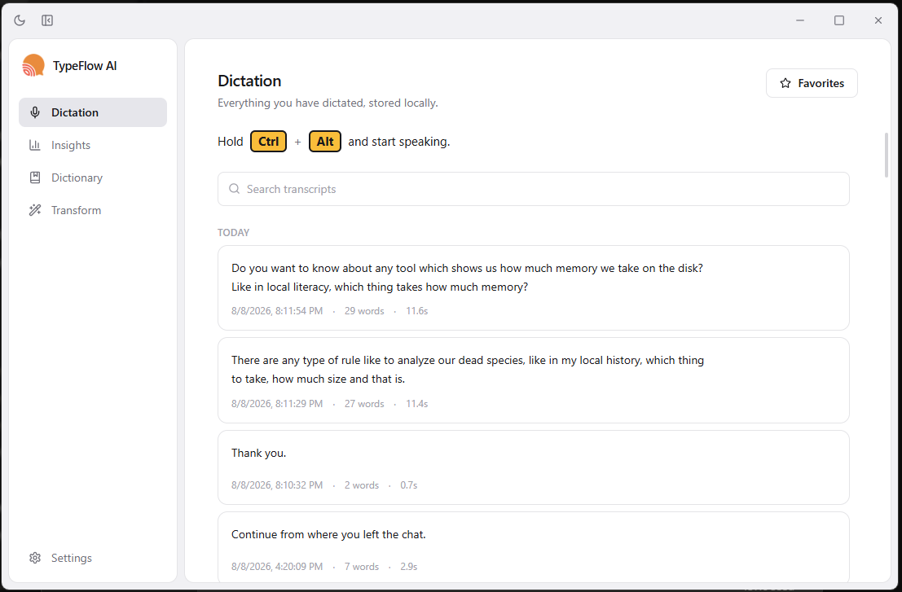
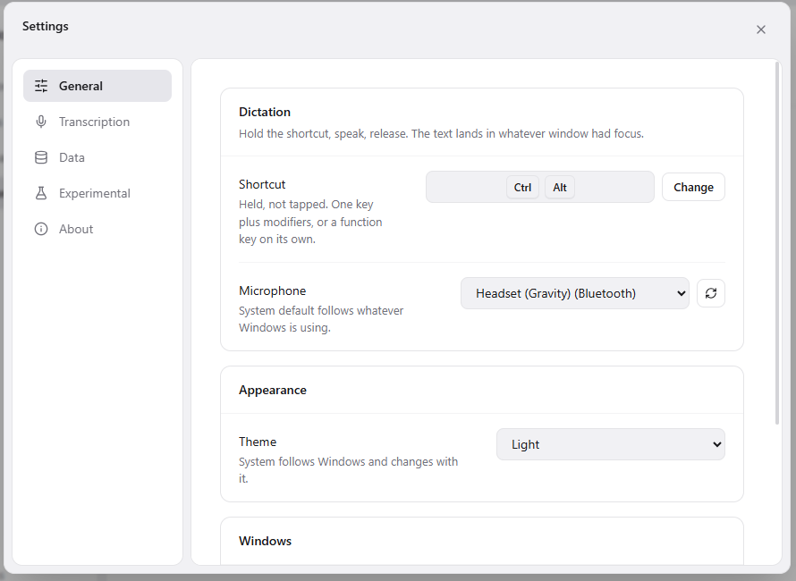
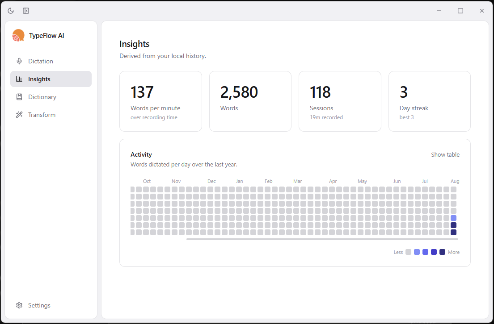
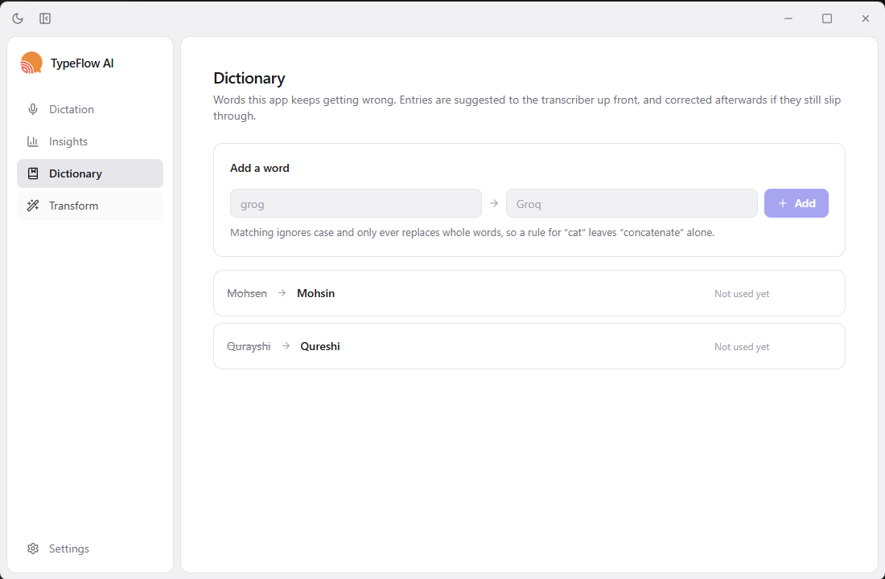

# TypeFlow AI

**Local-first desktop dictation for Windows.** Hold `Ctrl` + `Win` (the
default — rebind it to anything), speak, release. The text appears in whatever
application had focus — your editor, a browser field, Slack, anything.

No account. No login. No cloud database. Your dictation history, statistics
and recordings live in a SQLite file on your machine and never leave it.



> **Status:** v0.1.0, Windows x64 only. Built by one person for their own
> daily use, then opened up. It works, it is not polished for scale, and there
> is no support commitment.

---

## What actually leaves your computer

One thing: **the audio clip**, sent to [Groq](https://groq.com) to be
transcribed by Whisper. That is the entire network surface.

What never leaves:

- your transcripts and history — SQLite, `%APPDATA%\typeflow-ai`
- your recordings — WAV files in the same folder
- your settings and personal dictionary
- your Groq API key — encrypted at rest with Windows DPAPI via Electron's
  `safeStorage`, keyed to your Windows account, stored outside the database

There is no telemetry, no analytics, and no crash reporting.

---

## Install

Download the latest `TypeFlow AI-<version>-setup.exe` from the
[Releases](../../releases) page and run it. It installs per-user and does not
ask for administrator rights.

### Windows will warn you, and it is right to

The installer is **not code signed** — a certificate costs a few hundred
dollars a year, which is not justified for v0.1.0 of a personal project. So
Windows SmartScreen shows:

> **Windows protected your PC**
> Microsoft Defender SmartScreen prevented an unrecognised app from starting.

Click **More info** → **Run anyway**.

This warning means "nobody has paid to vouch for this file", not "this file is
known to be malicious". If you would rather not take that on faith, every
release lists a SHA256 checksum, and you can
[build it yourself](#build-from-source) from this source in about five
minutes.

---

## Setup

You need a free Groq API key. There is no bundled key and no server in front
of the API — you talk to Groq directly with your own credentials.

1. Sign up at [console.groq.com](https://console.groq.com) — free tier, no
   card required.
2. Create an API key. It starts with `gsk_`.
3. In TypeFlow AI, open **Settings → Transcription** and paste it.

The key is encrypted immediately and written to `groq-key.bin` in the app's
data folder. Copying that file to another machine gets you nothing: DPAPI ties
it to your Windows user account.

---

## Using it

| Action                    | How                                            |
| ------------------------- | ---------------------------------------------- |
| Dictate                   | Hold your shortcut, speak, release              |
| Cancel mid-sentence       | `Esc` while recording                           |
| Change the shortcut       | Settings → General                              |
| Review or replay history  | Dictation tab — every session, with its audio   |
| Fix recurring misspellings| Dictionary tab — deterministic replacements     |

The floating widget appears on whichever monitor your cursor is on, and never
takes focus — that is what makes inserting into the app behind it possible.

The shortcut is yours to pick — hold, don't tap. One key plus modifiers, or a
function key on its own.



### Insights

Words per minute, total words, sessions and streaks, all derived from your
local history. Nothing is uploaded to produce these — they are queries against
your own database.



### Personal dictionary

Whisper reliably mangles proper nouns. The dictionary is a plain list of
find-and-replace rules applied after transcription, so `grog` → `Groq` once
and it stays fixed. Entries also seed Whisper's vocabulary hint, which
prevents some errors instead of correcting them.

Matching ignores case and only ever replaces whole words, so a rule for `cat`
leaves `concatenate` alone.



---

## Known limitations

These are real and documented rather than hidden:

- **It cannot type into elevated windows.** A non-elevated process cannot send
  input to a process running as administrator — this is Windows UIPI, not a
  bug. Dictating into an admin terminal shows "Can't type into this window"
  rather than pretending it worked.
- **It needs a network connection.** Expect 1–2 seconds between releasing the
  key and text appearing. Roughly 95% of that is network round-trip and
  free-tier queueing, not transcription.
- **Grammar cleanup is off by default.** An LLM pass over Whisper's output
  measurably deletes words — it has to cut something to make ungrammatical
  input read cleanly. The raw transcript is always stored and always shown.
- **Very short or very quiet clips are dropped.** Whisper hallucinates
  confident text out of silence ("Thank you."), so clips under 400ms or below
  an amplitude floor are rejected with "Didn't catch that".
- **Windows only.** The keyboard hook, the insertion path and the packaging
  are all Windows-specific. There is no macOS or Linux build and none planned.

---

## Build from source

Requires Node 20+ and the Windows build tools that native modules need
(Visual Studio Build Tools with the C++ workload).

```bash
git clone https://github.com/mohsinjameelqureshi/typeflow-ai.git
cd typeflow-ai
npm install          # postinstall runs electron-rebuild — do not skip it
npm run dev          # development, with hot reload
npm run dist         # produces release/TypeFlow AI-<version>-setup.exe
```

`better-sqlite3` and `uiohook-napi` are native modules and must be compiled
against Electron's ABI, not Node's. That is what the `postinstall` step does.
If you ever see a `NODE_MODULE_VERSION` mismatch error, run
`npx electron-rebuild` and it goes away.

Other scripts:

| Script              | Does                                          |
| ------------------- | --------------------------------------------- |
| `npm run typecheck` | Strict TypeScript over main, preload, renderer |
| `npm run build`     | Typecheck, then bundle                         |
| `npm run pack`      | Unpacked build in `release/`, no installer     |
| `npm run db:generate` | Generate a Drizzle migration from the schema |

---

## How it works

```
Ctrl+Win held  →  uiohook-napi keydown  →  widget shown (never focused)
                                        →  16kHz mono WAV captured
Key released   →  silence/amplitude gate →  Groq Whisper large-v3-turbo
                                        →  personal dictionary replacement
                                        →  clipboard save → paste → restore
                                        →  row + WAV written to SQLite
```

- **Electron** main process owns the keyboard hook, the database, the network
  call and the insertion. The renderer is sandboxed with
  `contextIsolation: true`, `nodeIntegration: false` and a typed preload
  bridge — it never touches the filesystem or the API key.
- **Insertion is via the clipboard**, not simulated typing. Typing character
  by character is visibly slow on long text and mangles non-ASCII and emoji.
  Your clipboard contents are restored afterwards.
- **Audio playback** goes through a custom `typeflow-audio://` protocol that
  resolves files in the main process from a dictation id — the renderer can
  never name a path.
- **Speech providers are behind an interface** (`src/services/speech/types.ts`)
  with one implementation. Swapping Groq for a local whisper.cpp or another
  API is meant to be a small change.

[`CLAUDE.md`](CLAUDE.md) is the real build specification — measured latency
numbers, the constraints that silently break Electron dictation apps, and why
each decision went the way it did. Read it before contributing.

---

## Contributing

See [CONTRIBUTING.md](CONTRIBUTING.md). Issues welcome; open one before
starting a large pull request.

## Security

See [SECURITY.md](SECURITY.md) for the threat model and how to report a
vulnerability privately.

## License

[MIT](LICENSE) © 2026 Mohsin Jameel Qureshi
